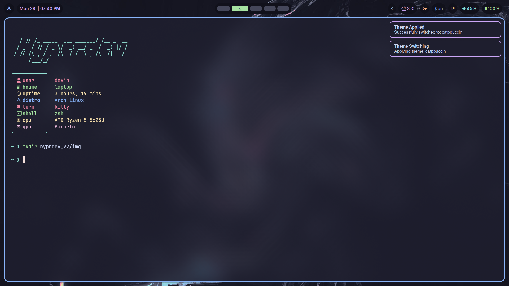
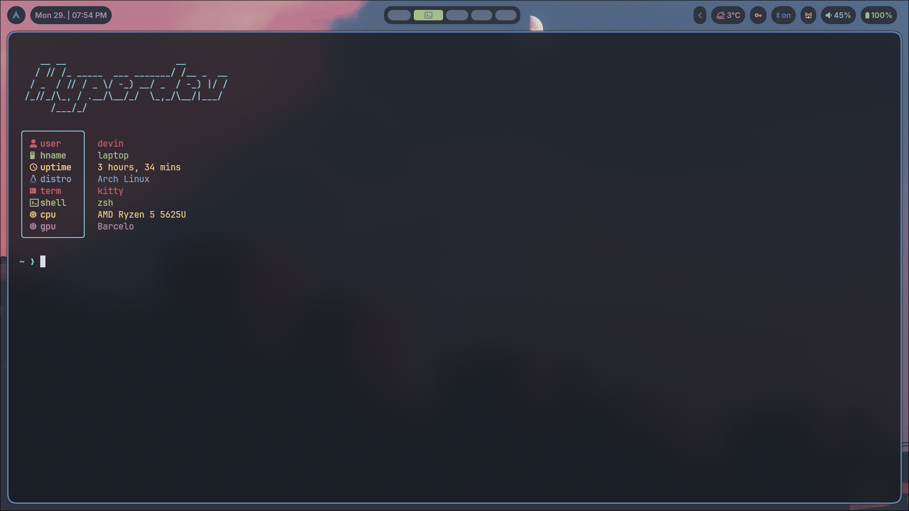
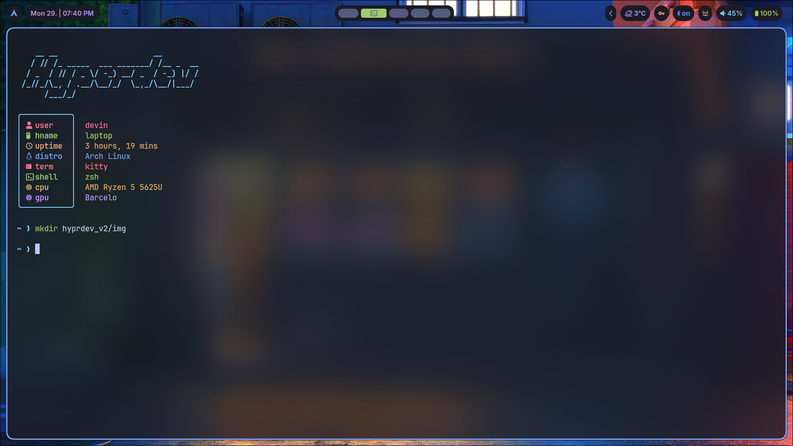

# Hyprdev v2


 <br><br>

## About

Go to [keybindings](#keybinds)<br>
Go to [installation](#installation)<br>
Go to [troubleshoot](#troubleshoot)<br><br>

## Configuration

If you want to configure this setup and change some stuff,
you can find the most in the `~/.config` folder under the specific
element. For example you want to change the waybar configuration. You would then
go to the `~/.config/waybar/config.jsonc` file and change according to
their wiki the modules you want. This way everything is
relatively easy to configure. But if something is not clear feel
free to open an issue and i'll do my best to resolve it or
write a walkthrough on how to do it yourself.

### Disclaimer

I love vim and the philosophy about only using the keyboard hence
why most of the programs I setup use vimkeys.
If you don't like that (which I think you do :upside_down_face:)
then you might need to reconfigure a lot. And everything is
terminal based.

### Hyprland configuration

[Here](https://wiki.hyprland.org/Configuring/) you can find everything regarding
hyprland.<br>
For multiple monitor configuration refer to [this](https://wiki.hyprland.org/Configuring/Monitors/)

I also added `editbinds`, `editkb` and `editmonitor` aliases
for easy access to common configurations.

> [!TIP]
> You can google what you need :wink:

## Screenshots

<details>
    <summary>Hyprdev</summary>
    
    
    
</details>

## Installation

> [!CAUTION]
> This project is aimed to be installed on a clean arch installation
> with nothing on it

```bash
git clone https://github.com/HanmaDevin/hyprdev_v2.git "$HOME/hyprdev_v2"
```

```bash
cd $HOME/hyprdev_v2/
```

```bash
./install.sh
```

### Nvidia

The install script scans for nvidia hardware and installs the driver for you :kiss:

<br>
You should be good to go afterwards. :shipit:

## Gaming

There are basic gaming apps like steam installed. For the most part gaming works
just fine out of the box
as usually espected with linux. Use this `gamemoderun %COMMAND%` launch
option on every game in steam.

Setting up anything other than steam the best thing to do is to install
the appropiate app via wine.
Download the .exe file and install like so `wine the_windows_gaming_app.exe`.
Steam will then recognize the app
and use it as the launcher just as windows would do it.

## Troubleshoot

Hyprland sometimes can be problematic so here you can find some problems
and how to fix them.

### Weather Widget

The weather widget needs an api key
from [OpenWeatherMap](https://openweathermap.org) it is a free one.
Create a file in `~/.env` containing `WEATHER_API=<your-key>` in one line.

#### CS2

Maybe you will experience sound and/or mouse issues to solve that add
these launch options `-sdlvideodriver x11` &
`-sdlaudiodriver pipewire` after the `%COMMAND%` part

## Keybinds

| Keybind                                                | Action                                             |
| ------------------------------------------------------ | -------------------------------------------------- |
| <kbd>Super</kbd> + <kbd>?</kbd>                        | Open Cheatsheet                                    |
| <kbd>Super</kbd> + <kbd>Return</kbd>                   | Open Terminal (Kitty)                              |
| <kbd>Super</kbd> + <kbd>Q</kbd>                        | Kill active Window                                 |
| <kbd>Super</kbd> + <kbd>I</kbd>                        | Install Software                                   |
| <kbd>Super</kbd> + <kbd>Backspace</kbd>                | Lock Screen (Hyprlock)                             |
| <kbd>Super</kbd> + <kbd>E</kbd>                        | Open Nautilus (File Manager)                       |
| <kbd>Super</kbd> + <kbd>V</kbd>                        | Toggle floating Window                             |
| <kbd>Super</kbd> + <kbd>Shift</kbd> + <kbd>R</kbd>     | Reload Waybar (Status Bar)                         |
| <kbd>Super</kbd> + <kbd>Delete</kbd>                   | Open Logout-Menu (wlogout)                         |
| <kbd>Alt</kbd> + <kbd>Shift</kbd>                      | Toggle Keyboard Layout                             |
| <kbd>Super</kbd> + <kbd>N</kbd>                        | Next Wallpaper                                     |
| <kbd>Super</kbd> + <kbd>P</kbd>                        | Pick Color on Screen (Hyprpicker)                  |
| <kbd>Super</kbd> + <kbd>S</kbd>                        | Start Sreensaver                                   |
| <kbd>Super</kbd> + <kbd>Space</kbd>                    | Open Application Launcher (rofi)                   |
| <kbd>Super</kbd> + <kbd>Alt</kbd> + <kbd>Space</kbd>   | Open Hyprdev Menu                                  |
| <kbd>Super</kbd> + <kbd>F</kbd>                        | Toggle Fullscreen                                  |
| <kbd>Super</kbd> + <kbd>H</kbd>                        | Move focus Left                                    |
| <kbd>Super</kbd> + <kbd>J</kbd>                        | Move focus Down                                    |
| <kbd>Super</kbd> + <kbd>K</kbd>                        | Move focus Up                                      |
| <kbd>Super</kbd> + <kbd>L</kbd>                        | Move focus Right                                   |
| <kbd>Super</kbd> + <kbd>Alt</kbd> + <kbd>H</kbd>       | Resize Window Left                                 |
| <kbd>Super</kbd> + <kbd>Alt</kbd> + <kbd>J</kbd>       | Resize Window Down                                 |
| <kbd>Super</kbd> + <kbd>Alt</kbd> + <kbd>K</kbd>       | Resize Window Up                                   |
| <kbd>Super</kbd> + <kbd>Alt</kbd> + <kbd>L</kbd>       | Resize Window Right                                |
| <kbd>Super</kbd> + <kbd>Shift</kbd> + <kbd>H</kbd>     | Move Window Left                                   |
| <kbd>Super</kbd> + <kbd>Shift</kbd> + <kbd>J</kbd>     | Move Window Down                                   |
| <kbd>Super</kbd> + <kbd>Shift</kbd> + <kbd>K</kbd>     | Move Window Up                                     |
| <kbd>Super</kbd> + <kbd>Shift</kbd> + <kbd>L</kbd>     | Move Window Right                                  |
| <kbd>Super</kbd> + <kbd>B</kbd>                        | Open Google Chrome                                 |
| <kbd>Super</kbd> + <kbd>C</kbd>                        | Open Clipboard History (rofi)                      |
| <kbd>Super</kbd> + <kbd>W</kbd>                        | Open Wallpaper selector (rofi)                     |
| <kbd>Super</kbd> + <kbd>M</kbd>                        | Open System Monitor (btop)                         |
| <kbd>Super</kbd> + <kbd>CTRL</kbd> + <kbd>V</kbd>      | Launch Sound Settings (wiremix)                    |
| <kbd>Super</kbd> + <kbd>Shift</kbd> + <kbd>S</kbd>     | Take Screenshot (saves to ~/Pictures/Screenshots/) |
| <kbd>Super</kbd> + <kbd>[0-9]</kbd>                    | Switch to Workspace [0-9]                          |
| <kbd>Super</kbd> + <kbd>Shift</kbd> + <kbd>[0-9]</kbd> | Move Window to Workspace [0-9]                     |
| <kbd>Super</kbd> + <kbd>Right Click</kbd>              | Resize Window with the Mouse                       |
| <kbd>Super</kbd> + <kbd>Left Click</kbd>               | Move Window with the Mouse                         |
